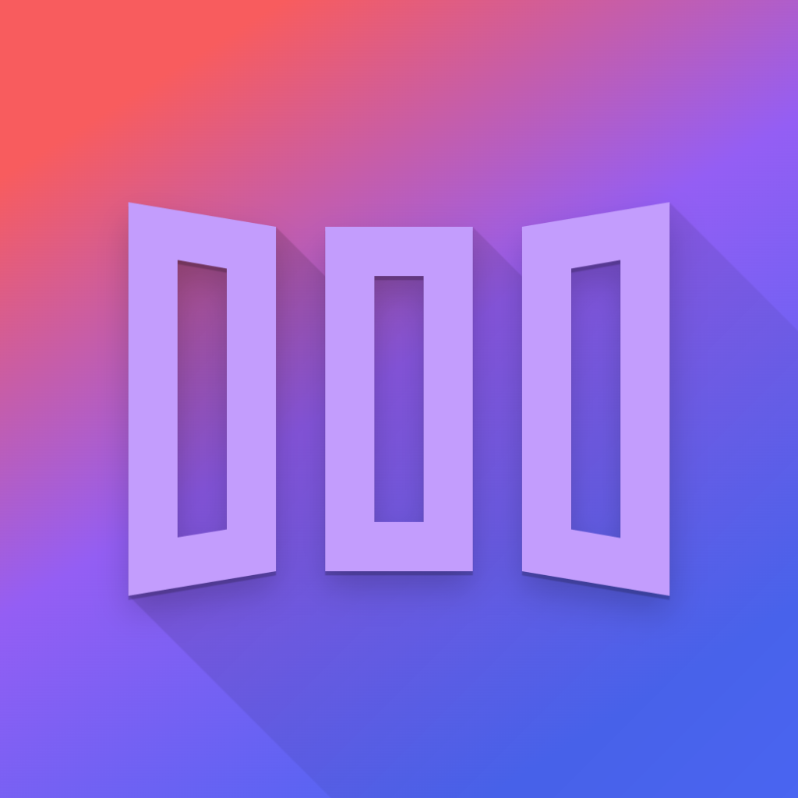

   

   

  <h1><b>AppNest</b></h1>
  
<i>An app launcher that runs iOS apps without actually installing them! </i>

# AppNest

- AppNest is an app launcher (not emulator or hypervisor) that allows you to run iOS apps inside it.
- Allows you to install unlimited apps (3 app/10 app id free developer account limit does not apply here) with only one app & app id. You can also have multiple versions of an app installed with multiple data containers.
- (Below iOS 26) When JIT is available, codesign is entirely bypassed, no need to sign your apps before installing. Otherwise, your app will be signed with the same certificate used by AppNest.

## Requirements

- iOS/iPadOS 15+
   + Multitasking requires iOS/iPadOS 16.0+
- AltStore 2.0+ / SideStore 0.6.0+

# Features & Guides

### Installing Apps
- Open AppNest, tap the plus icon in the upper right hand corner and select IPA files to install.
- Choose the app you want to open in the next launch.
- You can long-press the app to manage it.

To use multitasking, hold its banner and tap **"Multitask"**. You can also make Multitask the default launch mode in settings.

>1. To use multitasking, ensure you select **"Keep App Extensions"** when installing via SideStore/AltStore.  
>2. If you want to enable JIT for multitasked apps, you’ll need a JIT enabler that supports attaching by PID. (StikDebug)

### Fix File Picker & Local Notification
Some apps may experience issues with their file pickers or not be able to apply for notification permission in AppNest. To resolve this, enable "Fix File Picker" & "Fix Local Notifications" accordingly in the app-specific settings.

### "Open In App" Support
- You can simply share a URL or a file to app simply by using iOS's native share sheet. In share sheet, select AppNest, and AppNest will ask you which app you'd like to open that URL/file in.
- What's more, you also can tap the link icon in the top-right corner of the "Apps" tab and input the URL. AppNest will detect the appropriate app and ask if you want to launch it.
## Building
Open Xcode, edit `DEVELOPMENT_TEAM[config=Debug]` in `xcconfigs/Global.xcconfig` to your team id and compile.

## Project structure
### Main executable
- Core of AppNest
- Contains the logic of setting up guest environment and loading guest app.
- If no app is selected, it loads AppNestSwiftUI.

### MultitaskSupport
- Contains the implementation of multitasking feature.
- Based on [FrontBoardAppLauncher](https://github.com/khanhduytran0/FrontBoardAppLauncher)

### SideStore
- Supporting code for SideStore's app refreshing integration

### TweakLoader
- A simple tweak injector, which loads CydiaSubstrate and loads tweaks.
- Injected to every app you install in AppNest.

### ZSign
- The app signer shipped with AppNest.
- Originally made by [zhlynn](https://github.com/zhlynn/zsign).
- AppNest uses [Feather's](https://github.com/khcrysalis/Feather) version of ZSign modified by khcrysalis.
- Changes are made to meet AppNest's needs.

## How does it work?

### Patching guest executable
- Patch `__PAGEZERO` segment:
  + Change `vmaddr` to `0xFFFFC000` (`0x100000000 - 0x4000`)
  + Change `vmsize` to `0x4000`
- Change `MH_EXECUTE` to `MH_DYLIB`.
- Inject a load command to load `TweakLoader.dylib`

### Patching `@executable_path`
- Hook `dyld4::APIs::_NSGetExecutablePath`
- Call `_NSGetExecutablePath`
- Replace `config.process.mainExecutablePath`
  - Calculate address of `config.process.mainExecutablePath` using `dyld4::APIs` instance (passed as first parameter)
  - Use `builtin_vm_protect` or TPRO unlock to make it writable
  - Replace the address with one we have control of
- Put the original `dyld4::APIs::_NSGetExecutablePath` back

### Patching `NSBundle.mainBundle`
- This property is overwritten with the guest app's bundle.

### Bypassing Library Validation
- JIT is optional to bypass codesigning. In JIT-less mode, all executables are signed so this does not apply.
- Derived from [Restoring Dyld Memory Loading](https://blog.xpnsec.com/restoring-dyld-memory-loading)

### dlopening the executable
- Call `dlopen` with the guest app's executable
- TweakLoader loads all tweaks in the selected folder
- Find the entry point
- Jump to the entry point
- The guest app's entry point calls `UIApplicationMain` and start up like any other iOS apps.

### Multi-Account support & Keychain Semi-Separation
[128 keychain access groups](./entitlements.xml) are created and AppNest allocates them randomly to each container of the same app. So you can create 128 container with different keychain access groups.

## Limitations
- Entitlements from the guest app are not applied to the host app. This isn't a big deal since sideloaded apps requires only basic entitlements.
- App Permissions are globally applied.
- Guest app containers are not sandboxed. This means one guest app can access other guest apps' data.
- App extensions aren't supported. they cannot be registered because: AppNest is sandboxed, SpringBoard doesn't know what apps are installed in AppNest, and they take up App ID.
- Multitasking can be achieved by using multiple AppNest and the multitasking feature. However, while we were able to fix physical keyboard input issue on iPadOS (https://github.com/AppNest/AppNest/issues/524), iPhone Mirroring uses different checks which still broke it (https://github.com/AppNest/AppNest/issues/793).
- Remote push notification will not work
- Querying custom URL schemes might not work(?)

## TODO
- Use ChOma instead of custom MachO parser

## Credits
- [xpn's blogpost: Restoring Dyld Memory Loading](https://blog.xpnsec.com/restoring-dyld-memory-loading)
- [LinusHenze's CFastFind](https://github.com/pinauten/PatchfinderUtils/blob/master/Sources/CFastFind/CFastFind.c): [MIT license](https://github.com/pinauten/PatchfinderUtils/blob/master/LICENSE)
- [litehook](https://github.com/opa334/litehook): [MIT license](https://github.com/opa334/litehook/blob/main/LICENSE)
- @haxi0 & @m1337v for icon
- @Vishram1123 for the initial shortcut implementation.
- @hugeBlack for SwiftUI contribution
- @Staubgeborener for automatic AltStore/SideStore source updater
- @fkunn1326 for improved app hiding
- @slds1 for dynamic color feature
- @Vishram1123 for iOS 26+ JIT Script Support
- @StephenDev0 for AltStore source support
